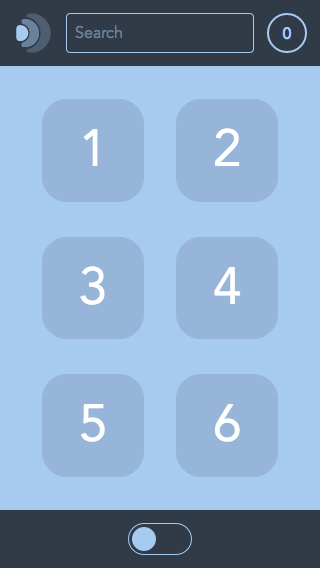

# Digit Layouts

Some starter layouts to be used with the Digit UI set.

## How to use

Basically you can use one of the `app.reel`s as your main component. Below a guide for App 1 (phone layout).

1. Clone this repo
2. Delete `index.html`
3. Rename `1.html` to `index.html`.
4. Move `ui/app1/app.reel` a level up -> `ui/app.reel`
5. Change the `mainModule` path in `index.html` to `"mainModule": "ui/app.reel"`.
6. Delete all the un-used stuff.. like 2.html, ui/app2 etc.
7. Now you're free to edit `ui/app.reel` and add new components.

